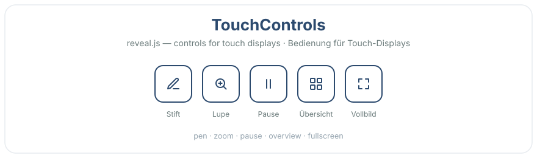

# Reveal - TouchControls

[](https://revealjs.com) [](LICENSE)

**EN** — On-screen controls that make [reveal.js](https://revealjs.com) easy to operate on touch displays and smartboards: annotate with a pen, zoom into a spot, blank the screen, open the overview, go fullscreen. No keyboard or mouse needed. Standalone (ships its own CSS) and a natural companion to [Smallcontrol](https://github.com/Martinomagnifico/reveal.js-smallcontrol).

**DE** — Bildschirm-Bedienelemente, um [reveal.js](https://revealjs.com) bequem am Touch-Display oder Smartboard zu bedienen: mit dem Stift markieren, in eine Stelle zoomen, Bildschirm schwarz, Übersicht, Vollbild. Ohne Tastatur oder Maus. Eigenständig (bringt sein CSS selbst mit) und ein guter Begleiter zu [Smallcontrol](https://github.com/Martinomagnifico/reveal.js-smallcontrol).

**[▶ Live demo · Demo ansehen](https://florianloyns.github.io/reveal.js-touchcontrols/demo.html)**

[](https://florianloyns.github.io/reveal.js-touchcontrols/demo.html)

## Installation

**EN** Copy the `touchcontrols` folder into your reveal.js `plugin/` folder — or install from npm.
**DE** Den Ordner `touchcontrols` in den `plugin/`-Ordner von reveal.js kopieren — oder per npm.

```console
npm install reveal.js-touchcontrols
```

## Setup

**Regular / Klassisch**

```html
<script src="dist/reveal.js"></script>
<script src="plugin/touchcontrols/touchcontrols.js"></script>
<script>
  Reveal.initialize({ plugins: [ RevealTouchControls ] });
</script>
```

**As a module / Als Modul**

```html
<script type="module">
  import Reveal from './dist/reveal.esm.js';
  import RevealTouchControls from './plugin/touchcontrols/touchcontrols.esm.js';
  Reveal.initialize({ plugins: [ RevealTouchControls ] });
</script>
```

## Usage / Bedienung

- **Pen · Stift** — tap cycles off → colour 1 → colour 2 → off; long-press clears the slide.
  Tippen schaltet aus → Farbe 1 → Farbe 2 → aus; langer Druck löscht die Folie.
- **Zoom · Lupe** — tap, then tap the spot to zoom in; tap again to reset.
  Antippen, dann die Stelle antippen zum Zoomen; erneut tippen = zurück.
- **Pause · Overview · Fullscreen** — one tap each. / je ein Tipp.

Buttons turn white on dark slides automatically. / Auf dunklen Folien werden die Buttons automatisch weiß.

## Configuration / Konfiguration

All options are optional. / Alle Optionen sind optional.

```js
Reveal.initialize({
  touchcontrols: {
    side: 'left',                 // 'left' | 'right'
    bottom: 32,
    accent: '#2C4A6E',
    hover: 'rgba(44,74,110,.10)',
    inks: ['#D14A4A', '#2B6CB0'],
    penWidth: 4,
    buttons: ['pen','zoom','pause','overview','fullscreen'],
    autohide: true,
    autohideDelay: 3500
  },
  plugins: [ RevealTouchControls ]
});
```

| Option | Default | EN / DE |
|---|---|---|
| `side` | `'left'` | Corner `'left'` \| `'right'` / Ecke |
| `bottom` | `32` | Offset from bottom, px / Abstand unten |
| `accent` | `'#2C4A6E'` | Button colour / Buttonfarbe |
| `hover` | `'rgba(44,74,110,.10)'` | Hover colour / Hover-Farbe |
| `inks` | `['#D14A4A','#2B6CB0']` | Pen colours, cycled / Stiftfarben, zyklisch |
| `penWidth` | `4` | Stroke width / Strichstärke |
| `buttons` | all five | Buttons shown + order / Auswahl + Reihenfolge |
| `autohide` | `true` | Hide when idle / bei Inaktivität ausblenden |
| `autohideDelay` | `3500` | ms before hiding / ms bis Ausblenden |

## Like it? / Gefällt es?

Star the repo. / Gib dem Repo einen Stern.

## License

MIT — see [LICENSE](LICENSE). Thanks to Hakim El Hattab (reveal.js) and Martijn De Jongh (Smallcontrol).
